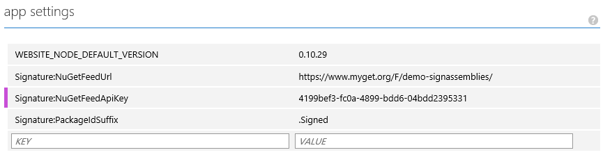

# NuGet Signature

Library and web project that can sign NuGet packages, for example triggered by MyGet Webhooks.

## Integrating NuGet Signature with MyGet

A nice use case for this repository is automatically signing unsigned NuGet packages that are pushed to a [MyGet](http://www.myget.org) feed.

### Deploy and configure NuGet Signature

First of all, deploy NuGet Signature to a web server, for example Microsoft Azure Websites. Then, configure the application using the management dashboard. The following settings must be provided:

* ```Signature:KeyFile``` - path to the PFX file to use when signing
* ```Signature:KeyFilePassword``` - private key/password for using the PFX file
* ```Signature:PackageIdSuffix``` - suffix for signed package id's. Can be empty or something liek ".Signed"
* ```Signature:NuGetFeedUrl``` - NuGet feed to push signed packages to
* ```Signature:NuGetFeedApiKey``` - API key for pushing packages to the above feed

The configuration in the Microsoft Azure Management Dashboard could look like the following:



